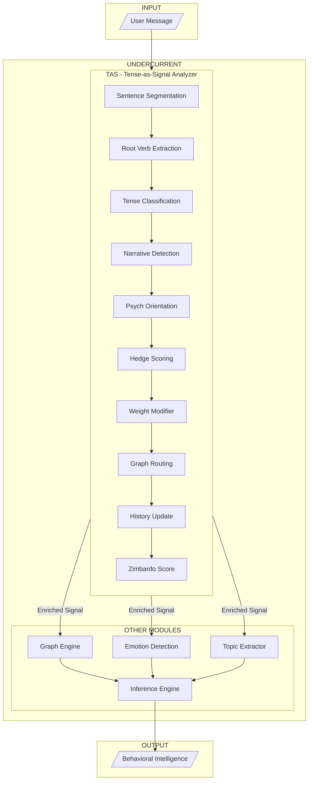
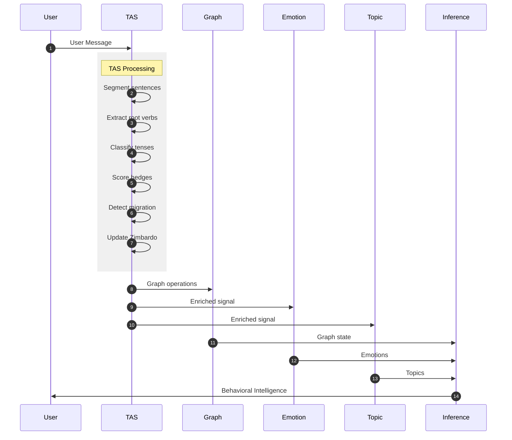
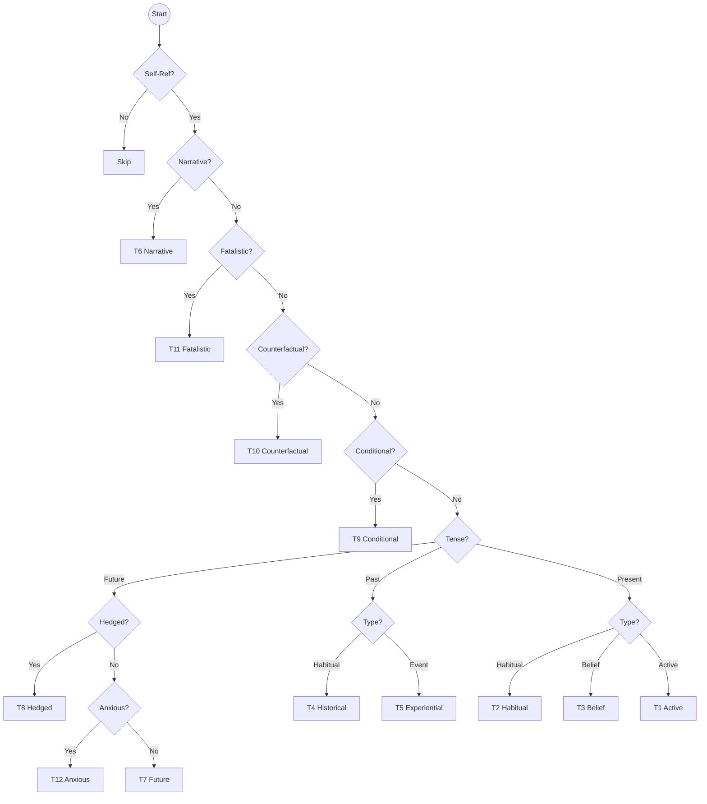
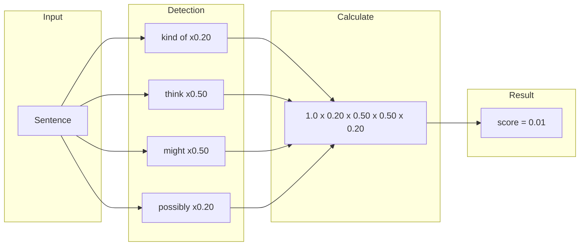
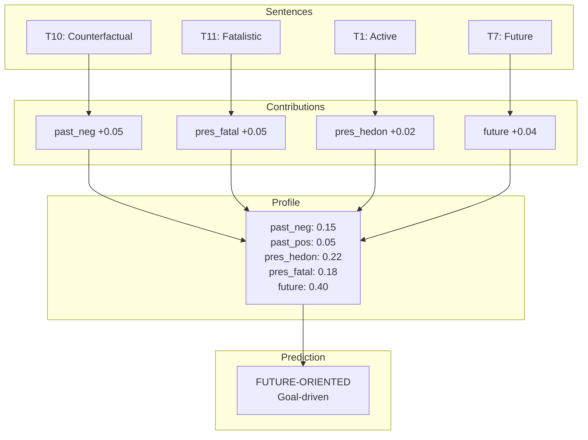
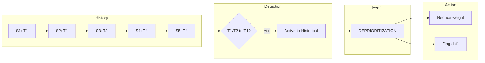
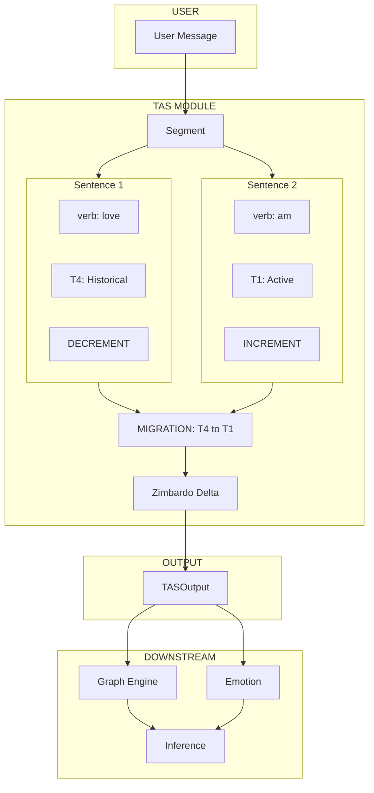

# Undercurrent System Architecture — Mermaid Diagrams

## 1. High-Level System Overview

---

## 2. TAS Module — Detailed Pipeline

```mermaid
flowchart TD
    subgraph INPUT[INPUT]
        MSG[/Raw Message/]
        HIST[(Tense History)]
    end

    subgraph TAS[TAS MODULE]
        direction TB
        
        subgraph PARSE[PARSING]
            S1[Segmentation]
            S2[Dependency Parse]
            S3[Root Verb]
        end
        
        subgraph CLASSIFY[CLASSIFICATION]
            C1{Tense?}
            C2{Narrative?}
            C3{Fatalistic?}
            C4{Conditional?}
            C5{Hedged?}
        end
        
        subgraph CLASSES[12 TENSE CLASSES]
            T1[T1: Active]
            T2[T2: Habitual]
            T3[T3: Belief]
            T4[T4: Historical]
            T5[T5: Experiential]
            T6[T6: Narrative]
            T7[T7: Future]
            T8[T8: Hedged]
            T9[T9: Conditional]
            T10[T10: Counterfactual]
            T11[T11: Fatalistic]
            T12[T12: Anxious]
        end
        
        subgraph SCORE[SCORING]
            H1[Hedge Detection]
            H2[Score Calc]
            H3[Weight Modifier]
        end
        
        subgraph ENRICH[ENRICHMENT]
            E1[Self-Reference]
            E2[Zimbardo]
            E3[Migration]
            E4[Graph Op]
        end
    end

    subgraph OUTPUT[OUTPUT]
        OUT[/TASOutput/]
    end

    MSG --> S1 --> S2 --> S3
    S3 --> C1 --> C2 --> C3 --> C4 --> C5
    C5 --> CLASSES
    CLASSES --> H1 --> H2 --> H3
    H3 --> E1 --> E2 --> E3 --> E4
    HIST --> E3
    E4 --> OUT
```

---

## 3. Information Flow — Message to Behavioral Intelligence

---

## 4. Tense Classification Decision Tree

---

## 5. Hedge Score Calculation

---

## 6. Zimbardo Profile Accumulation

---

## 7. Tense Migration Detection

---

## 8. Complete Data Flow

---

## How to View These Diagrams

1. **VS Code**: Install "Markdown Preview Mermaid Support" extension
2. **GitHub**: Renders automatically in markdown files
3. **Online**: Use [Mermaid Live Editor](https://mermaid.live/)

---

*Last Updated: February 2026*
