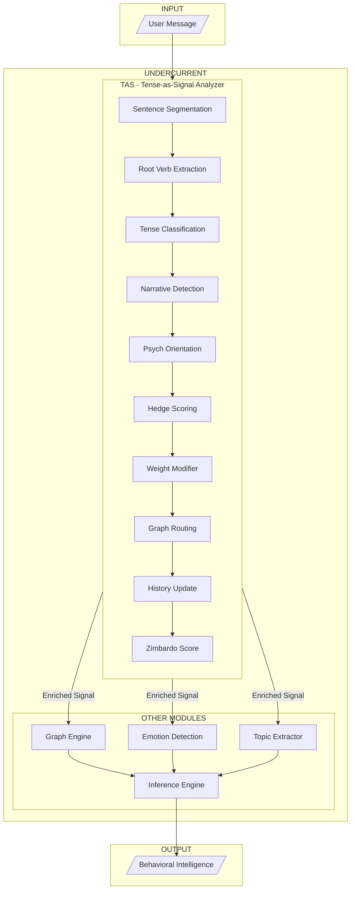

# System Overview

High-level view of TAS within the Undercurrent system.

```mermaid
flowchart TB
    subgraph INPUT[INPUT]
        UM[/User Message/]
    end

    subgraph UNDERCURRENT[UNDERCURRENT]
        
        subgraph TAS[TAS - Tense-as-Signal Analyzer]
            direction TB
            T1[Sentence Segmentation]
            T2[Root Verb Extraction]
            T3[Tense Classification]
            T4[Narrative Detection]
            T5[Psych Orientation]
            T6[Hedge Scoring]
            T7[Weight Modifier]
            T8[Graph Routing]
            T9[History Update]
            T10[Zimbardo Score]
            
            T1 --> T2 --> T3 --> T4 --> T5 --> T6 --> T7 --> T8 --> T9 --> T10
        end
        
        subgraph OTHER[OTHER MODULES]
            GE[Graph Engine]
            ED[Emotion Detection]
            TE[Topic Extractor]
            IE[Inference Engine]
        end
        
        TAS -->|Enriched Signal| GE
        TAS -->|Enriched Signal| ED
        TAS -->|Enriched Signal| TE
        GE --> IE
        ED --> IE
        TE --> IE
    end

    subgraph OUTPUT[OUTPUT]
        BI[/Behavioral Intelligence/]
    end

    UM --> TAS
    IE --> BI
```
