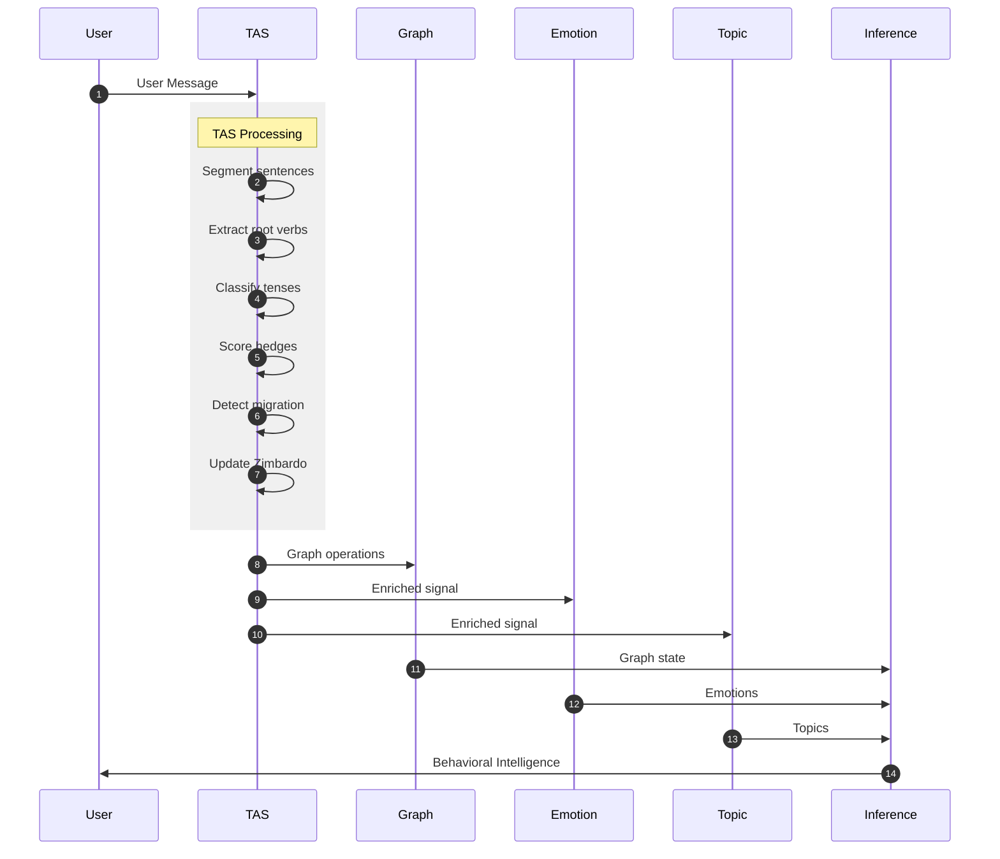

# Information Flow

Sequence diagram showing message flow through the system.

```mermaid
sequenceDiagram
    autonumber
    participant U as User
    participant TAS as TAS
    participant GE as Graph
    participant ED as Emotion
    participant TE as Topic
    participant IE as Inference

    U->>TAS: User Message
    
    rect rgb(240, 240, 240)
        Note over TAS: TAS Processing
        TAS->>TAS: Segment sentences
        TAS->>TAS: Extract root verbs
        TAS->>TAS: Classify tenses
        TAS->>TAS: Score hedges
        TAS->>TAS: Detect migration
        TAS->>TAS: Update Zimbardo
    end

    TAS->>GE: Graph operations
    TAS->>ED: Enriched signal
    TAS->>TE: Enriched signal
    
    GE->>IE: Graph state
    ED->>IE: Emotions
    TE->>IE: Topics
    
    IE->>U: Behavioral Intelligence
```
