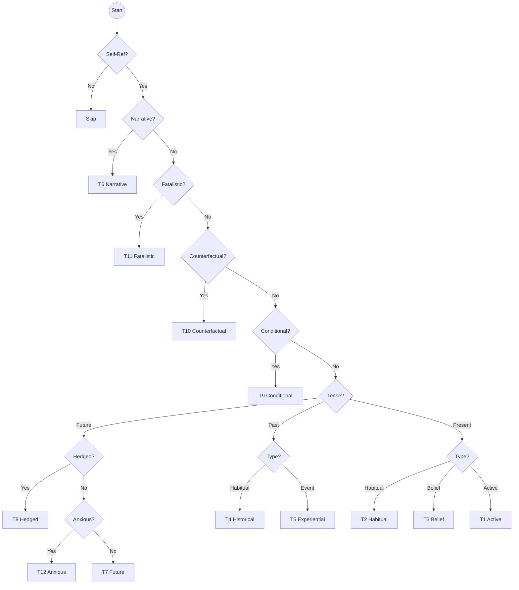

# Tense Classification Decision Tree

How sentences are classified into 12 tense classes.

```mermaid
flowchart TD
    START((Start)) --> SELF{Self-Ref?}
    
    SELF -->|No| SKIP[Skip]
    SELF -->|Yes| NARR{Narrative?}
    
    NARR -->|Yes| T6[T6 Narrative]
    NARR -->|No| FATAL{Fatalistic?}
    
    FATAL -->|Yes| T11[T11 Fatalistic]
    FATAL -->|No| COUNTER{Counterfactual?}
    
    COUNTER -->|Yes| T10[T10 Counterfactual]
    COUNTER -->|No| COND{Conditional?}
    
    COND -->|Yes| T9[T9 Conditional]
    COND -->|No| TENSE{Tense?}
    
    TENSE -->|Future| HEDGE{Hedged?}
    HEDGE -->|Yes| T8[T8 Hedged]
    HEDGE -->|No| ANX{Anxious?}
    ANX -->|Yes| T12[T12 Anxious]
    ANX -->|No| T7[T7 Future]
    
    TENSE -->|Past| EXP{Type?}
    EXP -->|Habitual| T4[T4 Historical]
    EXP -->|Event| T5[T5 Experiential]
    
    TENSE -->|Present| PRES{Type?}
    PRES -->|Habitual| T2[T2 Habitual]
    PRES -->|Belief| T3[T3 Belief]
    PRES -->|Active| T1[T1 Active]
```
