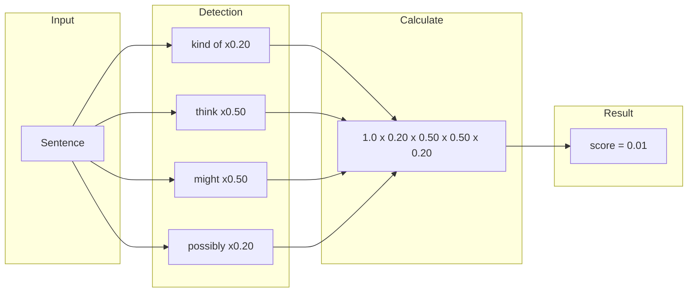

# Hedge Score Calculation

Multiplicative hedge scoring system.

## Hedge Categories

| Category | Multiplier | Examples |
|----------|------------|----------|
| Strong | x0.20 | maybe, someday, kind of |
| Medium | x0.50 | probably, might, could |
| Light | x0.77 | usually, generally |
| None | x1.0 | definitely, I will |
