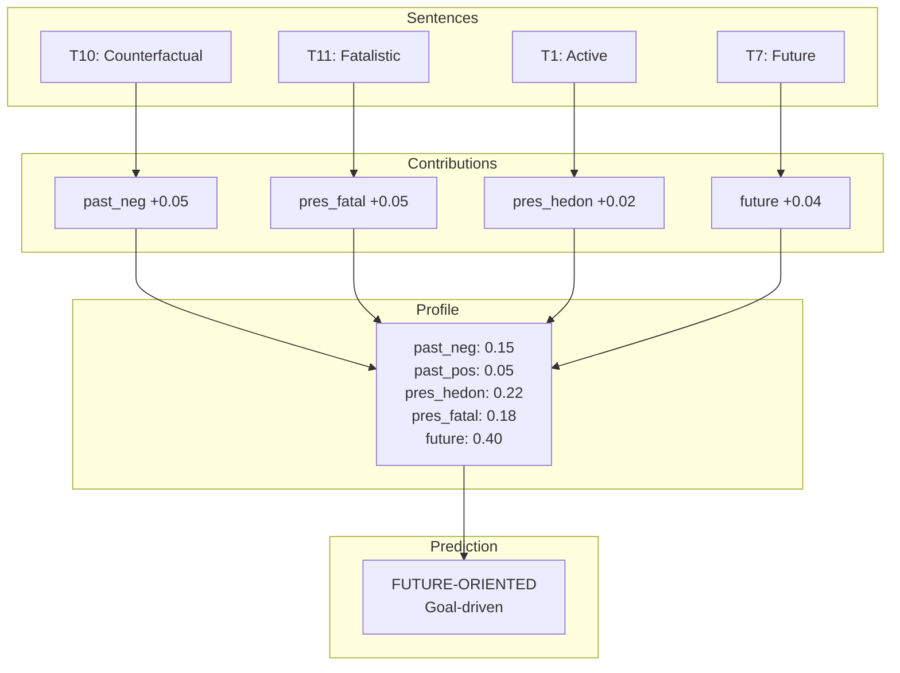

# Zimbardo Profile Accumulation

How temporal personality profiles are built over time.

## Profile Dimensions

| Dimension | Description |
|-----------|-------------|
| past_negative | Regret, rumination |
| past_positive | Nostalgia, warmth |
| present_hedonistic | Pleasure-seeking |
| present_fatalistic | Helplessness |
| future_oriented | Goal-driven |
