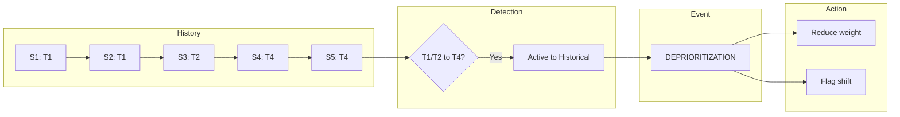

# Tense Migration Detection

Detecting behavioral shifts across sessions.

## Migration Types

| Migration | Signal | Action |
|-----------|--------|--------|
| T1/T2 → T4 | Deprioritization | Reduce weight |
| T4 → T1 | Reactivation | Increase weight |
| T7 → T8/T9 | Commitment decay | Flag concern |
| T8 → T7 | Commitment increase | Amplify |
