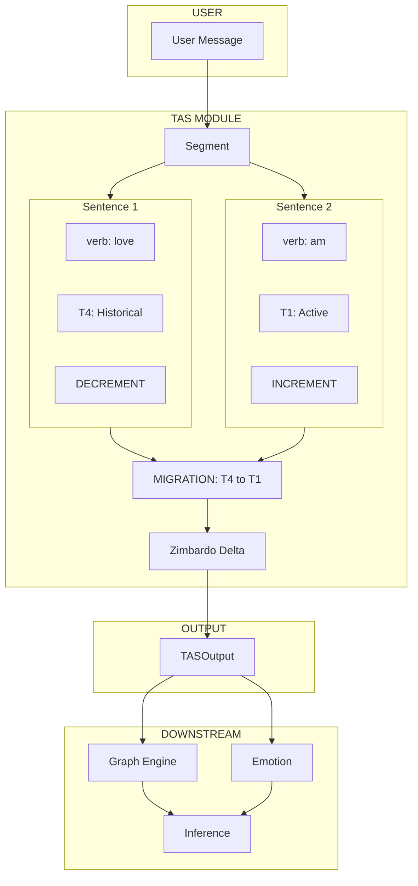

# Complete Data Flow

End-to-end example of message processing.

## Example

**Input**: "I used to love coding but now I'm really into it again"

**Output**:
- Sentence 1: T4 (Historical) → DECREMENT
- Sentence 2: T1 (Active) → INCREMENT
- Event: REACTIVATION migration detected
